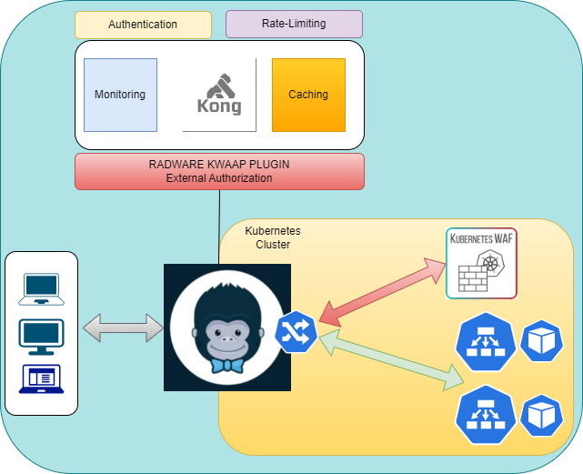

# KWAAP out-of-path integration with KONG API GW 

## This project is to create dev environment for KONG plugin smooth development

## Folder structure
### The name kong-plugin-rdwr-kwaap directory matches the name generated by KONG template for plugin creation
    .
    ├── config                  # declaritive kong configuration (this volume mounted to kong container)
    ├── doc                     # documentation and pictures for different usecases
    ├── kong
    │   └── plugins           
    │          └── rdwr-kwaap   # kong plugin for kwaf
    ├── kong-ingress            # configuration for kong-ingress helm chart  based on file values.yaml
    ├── pongo-in-docker         # scripts to run pongo in docker
    ├── spec                    # 
    │   └── rdwr-kwaap           
    │        │   └── rdwr-kwaap # test scenarios and fixtures
    │        └── README         # Test plan and PONGO docs
    ├── build.sh                # Install kong-ingress with helm 
    ├── docker-compose.yaml     # docker tool for defining and running services and containers - dev environment
    ├── docker-entrypoint.sh    # Dockerfile instruction specify the executable which should run when a container is started from a Docker image
    ├── Dockerfile              # directives to create container
    ├── kong-reloader.sh        # script to control restart of kong based on changes in plugin directories
    └── README.md

<p align="center">
  
</p>

# K8S KONG INGRESS Manual Configuration
### Create a ConfigMap or Secret with the plugin code
```bash
    kubectl create -n kong configmap kong-plugin-rdwr-kwaap --from-file=kong/plugins/rdwr-kwaap 
```
### Kong deployment - enable radware plugin
```bash
  - name: KONG_PLUGINS
    value: bundled,rdwr-kwaap
``` 
### Add ConfigMap (kong-plugin-rdwr-kwaap) as volume to Kong deployment
```bash
    volumeMounts:
    - mountPath: /opt/kong/plugins/rdwr-kwaap
        name: kong-plugin-rdwr-kwaap
    volumes:
    - configMap:
        defaultMode: 420
        name: kong-plugin-rdwr-kwaap
```
